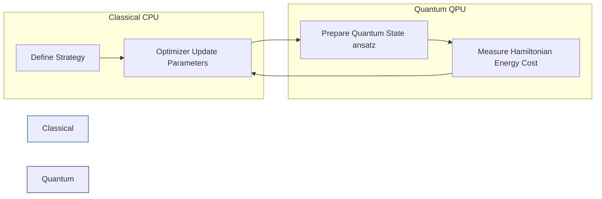

# Quantum Computing in Quantitative Finance (2025 Outlook)

**Abstract:**
As Moore's Law slows for classical silicon, Quantitative Finance is looking toward Quantum Computing (QC) for the next leap in performance. This document outlines the potential impact of QC on Curve Fitting, Pricing, and Risk Management.

## 1. The Core Promise: Complexity vs. Speed
In the context of the `tensor-yield` project, we care about two distinct mathematical problems:
1.  **Optimization:** Finding parameters that minimize error (Curve Calibration).
2.  **Integration:** Calculating expected values (Derivative Pricing).

| Problem Domain | Classical Solution | Quantum Candidate | Theoretical Speedup |
| :--- | :--- | :--- | :--- |
| **Optimization** | Gradient Descent / Levenberg-Marquardt | VQE / QAOA | Heuristic / Polynomial |
| **Pricing (Monte Carlo)** | Pseudo-Random Numbers | Quantum Amplitude Estimation (QAE) | **Quadratic (Proven)** |

## 2. Optimization & Curve Fitting (VQE / QAOA)
Standard OIS/SOFR bootstrapping is a linear algebra problem that classical computers handle effortlessly. Quantum computers will likely **not** replace classical machines for simple curve stripping.

However, for **Non-Convex Calibration**—such as fitting a Stochastic Volatility model (Heston/SABR) to a market surface with jagged data—classical optimizers often get stuck in local minima.

**The Hybrid Approach (NISQ Era):**
In the near term (Noisy Intermediate-Scale Quantum era), we use a **Classical-Quantum Hybrid** model. The Classical CPU manages the parameters, while the QPU (Quantum Processing Unit) estimates the cost function or gradients.

* **VQE (Variational Quantum Eigensolver):** Originally for chemistry, mapped to finance by treating the "Ground State" as the "Optimal Calibration Parameters."
* **QAOA (Quantum Approximate Optimization Algorithm):** Used for discrete combinatorial problems, potentially relevant for portfolio optimization.

## 3. Pricing & Simulation (Quantum Amplitude Estimation)
The "Holy Grail" for risk management is **Quantum Amplitude Estimation (QAE)**.

* **Classical Monte Carlo:** Convergence error scales as $O(1/\sqrt{N})$. To improve accuracy by 10x, you need 100x more paths.
* **Quantum QAE:** Convergence error scales as $O(1/N)$. To improve accuracy by 10x, you only need 10x more quantum operations.

## 4. The Verdict (2025)
* **For OIS Bootstrapping:** **Classical Wins.** AAD on GPUs is mature and fast.
* **For Exotic Calibration:** **Watch this space.** VQE shows promise.
* **For Pricing:** **Quantum Wins (Eventually).** QAE is mathematically superior, but hardware is the bottleneck.
